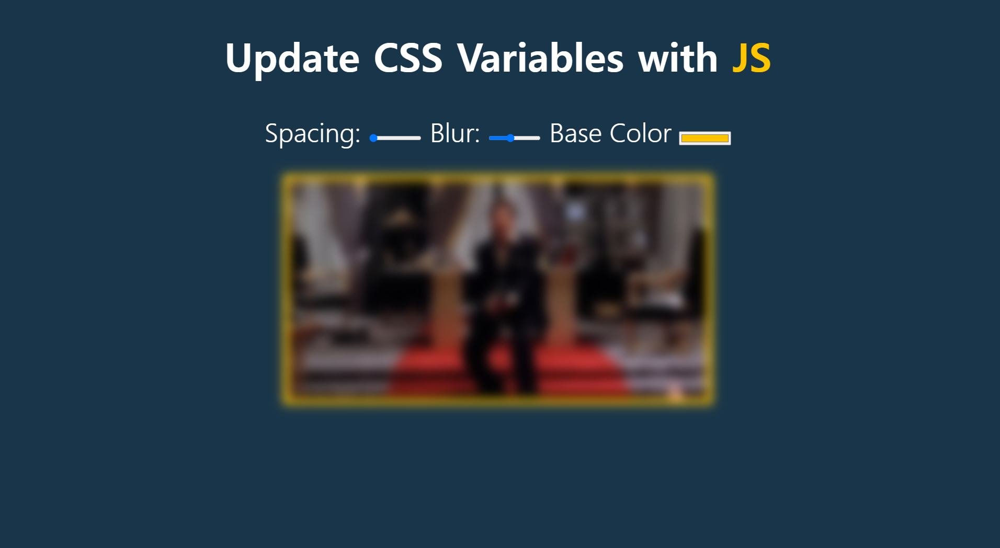

# Update CSS Variables with JS

This is the first project of [Wes Bos's JavaScript30](https://javascript30.com/).  

# Summary

Image editor written in JS.  
you can edit space, blurriness and color of the image by moving the bars.   

- Learn how to use CSS variable
- Learn how to reference CSS variable and put on other elements

