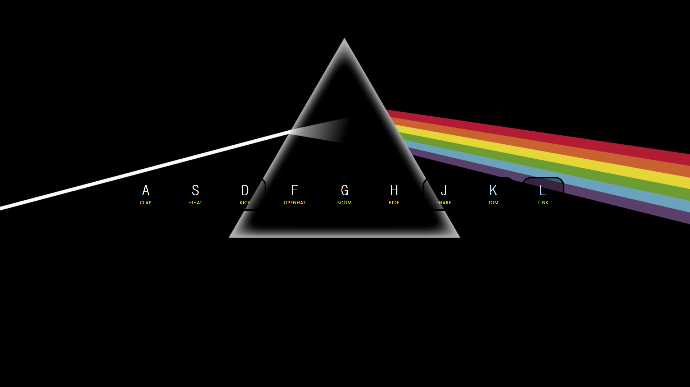

# JS Drumn Kit

This is the first project of [Wes Bos's JavaScript30](https://javascript30.com/).  

# Summary

Drum Kit written in JavaScript.  
자바스크립트로 작성된 드럼 입니다.

You can press the key A to L which is the horizontal line of the center of Keyboard and hear the sound of the drums.  
키보드 중앙의 A부터 L 까지의 키보드를 누르면 다양한 드럼 소리를 들을 수 있습니다.  

