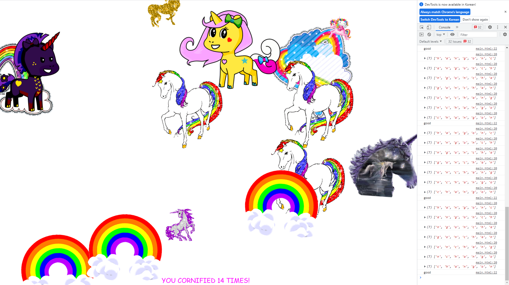

# Key Detection

This is the first project of [Wes Bos's JavaScript30](https://javascript30.com/).  

# Summary

Learn how to handle **keyup** event.  
Unicorn shows up if the word that you typed matches a designated word.  

